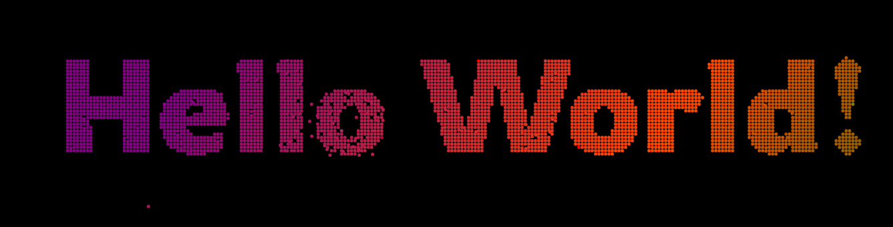
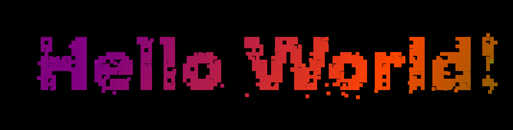
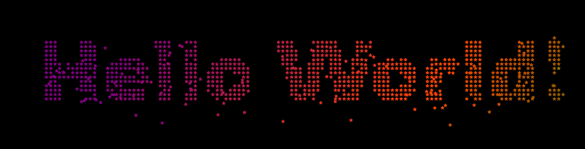
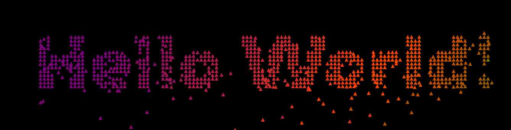

## Particle Text Effect

  
  
  
  
<!--  -->

### 🔗 Try It Out  
**Live Demo:** [https://textparticaleffect.netlify.app/](https://textparticaleffect.netlify.app/)

### Author  
**Kanthakumar**

### Description  
This particle effect is a customized version of an original concept by [Frank's Laboratory](https://www.youtube.com/@Frankslaboratory) on YouTube.

### Inspiration  
- 📺 Inspired by: [Frank's Laboratory - Particle Text Animation](https://www.youtube.com/watch?v=2F2t1RJoGt8)

### Credits  
A big thanks to Frank's Laboratory for the inspiring tutorial that laid the foundation for this effect.

If you enjoy interactive canvas animations, definitely check out the video and consider supporting the channel!
